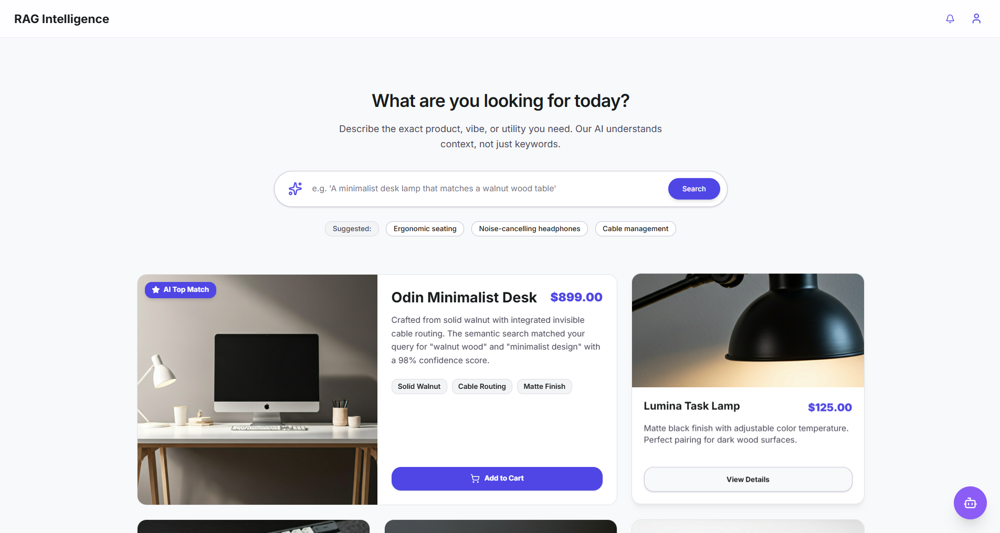
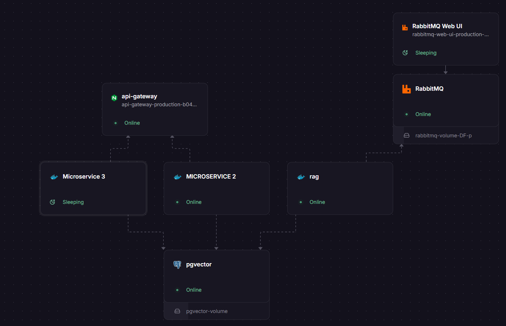

# AI-Powered RAG SaaS Platform for E-Commerce

> An enterprise-grade, multi-tenant SaaS platform that integrates directly with E-commerce ERPs (like Odoo) to provide real-time Semantic Search and Retrieval-Augmented Generation (RAG) chatbots.



## Overview

This project is a comprehensive SaaS solution designed to supercharge e-commerce stores with Artificial Intelligence. By synchronizing product catalogs in real-time using message brokers, generating vector embeddings, and utilizing Large Language Models (LLMs), it provides users with hyper-relevant product recommendations and an intelligent conversational shopping assistant.

The system is built with a robust **Microservices Architecture**, ensuring scalability, high availability, and separation of concerns. 

## ✨ Key Features

* **Real-Time ERP Synchronization:** Seamless integration with Odoo via RabbitMQ to sync products, prices, and stock instantly.
* **Multi-Tenant Architecture:** Securely isolate data, settings, and chat histories for multiple companies/tenants using a single deployment.
* **Semantic Product Search:** Powered by `pgvector` and Sentence Transformers to find products by meaning, not just exact keyword matches.
* **RAG Conversational Agent:** Context-aware chatbot utilizing Groq API (Llama 3) to answer customer queries strictly based on the available store catalog.
* **Admin & Tenant Dashboards:** Comprehensive Next.js frontend for monitoring token usage, chat latency, search analytics, and API Key management.

---

## 🏗️ Architecture & Tech Stack



### Frontend
* **Framework:** Next.js (App Router), React
* **Styling:** Tailwind CSS, Shadcn UI
* **State & Fetching:** React Hooks, Context API

### Backend (Microservices)
* **Framework:** FastAPI (Python 3.12)
* **Database:** PostgreSQL with `pgvector` extension, SQLAlchemy ORM
* **Message Broker:** RabbitMQ
* **AI & Embeddings:** `sentence-transformers` (all-MiniLM-L6-v2), Groq API (LLMs)
* **Authentication:** JWT (JSON Web Tokens), bcrypt hashing

### DevOps & CI/CD
* **Containerization:** Docker & Docker Compose
* **CI/CD Pipeline:** GitHub Actions (Automated Code Quality & Unit Testing)
* **Deployment:** Railway (Production Environment with Deployment Gates)
* **Testing:** Pytest (100% Code Coverage on core logic)

---

## 📂 Repository Structure

The workspace is configured as a monorepo containing the following core components:

* `frontend/`: The Next.js web application encompassing the Admin Dashboard, Tenant Portal, and the embeddable Chat/Search widgets.
* `backend/gateway/`: Nginx API Gateway routing external traffic securely to the internal microservices.
* `backend/microservice_1_sync/`: Handles RabbitMQ message consumption, text chunking, embedding generation, and vector database insertion.
* `backend/microservice_2_core/`: The administrative heart of the SaaS. Manages JWT authentication, tenant configurations, API keys, global settings, and metrics.
* `backend/microservice_3_rag/`: Exposes the AI endpoints. Performs semantic search queries against PostgreSQL and streams context to the Groq LLM for response generation.
* `odoo module/rag_sync/`: Custom Odoo add-on that hooks into product lifecycle events (create/update/delete) and pushes structured payloads to RabbitMQ.

---

## 🚀 Getting Started (Local Development)

### Prerequisites
* Docker and Docker Compose
* Python 3.12+
* Node.js (v18+) & pnpm
* An active Groq API Key

### 1. Database & Infrastructure Setup
Start the local PostgreSQL database and RabbitMQ instances using Docker:

```bash
cd backend
docker-compose up -d db rabbitmq
```

Run the initial SQL script (`scriptpgdb.sql`) to set up the `pgvector` extension and schemas.

### 2. Backend Setup
Each microservice has its own isolated environment. For each microservice folder (`microservice_1_sync`, `microservice_2_core`, `microservice_3_rag`):

```bash
python -m venv venv
source venv/bin/activate  # Or `venv\Scripts\activate` on Windows
pip install -r requirements.txt
uvicorn main:app --reload --port [8001/8002/8003]
```

### 3. Frontend Setup
Navigate to the frontend directory, install dependencies, and run the development server:

```bash
cd frontend
pnpm install
pnpm dev
```

---

## 🧪 Testing & CI/CD

Quality assurance is enforced through a strict CI/CD pipeline built with GitHub Actions.

* **Linting:** Flake8 and Pylint are used for static code analysis.
* **Unit Testing:** Pytest is implemented across all microservices, mocking external services (RabbitMQ, DB, Groq) to ensure **100% code coverage** of the business logic.
* **Continuous Deployment:** Merges to the `main` branch trigger the test suite. If successful, deployments to Railway are fully automated.

To run tests locally within any microservice:

```bash
pytest --cov=. --cov-report=term-missing
```

---

## 📄 License

This project was developed as a Capstone Engineering Project. All rights reserved.